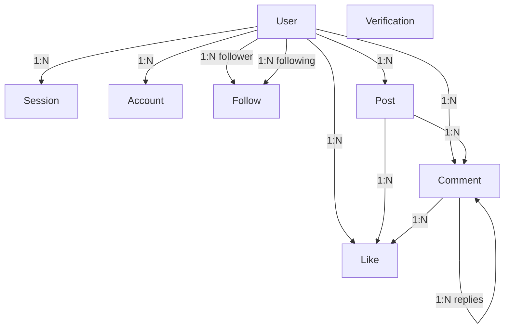

*This project has been created as part of the 42 curriculum by diwang, eandela, pekatsar, and nmattos-.*

## TRANSCENDENCE - 42OVERFLOW - DESCRIPTION 

Transcendence is the final project for the Codam Core curriculum, and must be completed with a team of 4-5 people. The goal is to simulate a professional software development team and environment, such that we build a product using a relevant tech stack as we would in the "real world." Our goal was to recreate a version of Stack Overflow for Codam students, 42overflow. The key features include a community where users can post questions related to the 42 curriculum (additionally comment/like/upload images), and ask AI/"AI Assist", with Advanced permissions and Organization features. Every user also has a robust profile, allowing them to follow accounts and see their online status.

## INSTRUCTIONS 

(section containing any relevant information about compilation, installation, and/or execution.)
 Step by step instructions to run the project. The app uses docker, and runs on one command - Docker Compose Up (e.g. Docker Compose up -d --build or Docker compose up --d) 
 Prerequisites include: SvelteKit, Prisma, PostgreSQL, bycrypt, better-auth, .env setup, 

## RESOURCES 

We leveraged several resources: 

https://svelte.dev/docs/kit/load https://better-auth.com/ http://better-auth.com/docs/adapters/postgresql
Description for how AI was used...

## TEAM INFO

| Name | Intra | Roles |
|------|------|-------------|
| Noah | (nmattos-) | PO + TL + Developer |
| Diane | (diwang) | PM + PO + Developer |
| Petya | (pekatsar) | PM + PO + Developer |
| Elroy | (eandela) | TL + Developer |

## PROJECT MANAGEMENT 

* Tools used for PM: Trello, Google Docs
* Communication channels: TEAMS, WhatsApp, IRL, Github 
* How the team organized the work: task distribution via Trello and meetings; weekly meetings (30-60 minutes)

## TECHNICAL STACK 

* Frontend + Backend: **SvelteKit**
* Database: **PostgreSQL**
* ORM: **Prisma**
* Authentication: **Better-auth**

TODO: Database system and why it was chosen. Any other significant technologies or libraries. Justification for major technical choices.

## DATABASE SCHEMA

### Overview

The application uses a PostgreSQL database managed through Prisma ORM. The schema supports user authentication, social interactions, comment/post creation, commenting, and liking functionality.

### Database Structure

#### Authentication Tables

* **User** – Stores user profile information and account settings.
* **Session** – Manages active user sessions and authentication tokens.
* **Account** – Stores authentication information (better-auth).
* **Verification** – Handles verification.

#### Application Tables

* **Follow** – Represents follower/following relationships between users.
* **Post** – Stores user-created posts.
* **Comment** – Stores comments on posts or other comments (threads).
* **Like** – Stores likes for posts and comments.

### Relationships

* A **User** can have multiple **Sessions** and **Accounts**.
* A **User** can create multiple **Posts** and **Comments**.
* Users can follow other users through the **Follow** table.
* A **Post** belongs to one User and can have multiple Comments and Likes.
* A **Comment** belongs to one Post and one User.
* A **Comment** can have a parent comment, and multiple children (replies).
* A **Like** belongs to one User and can be associated with either a Post or a Comment.

### Key Fields and Data Types

| Table        | Key Fields                            | Data Types                      |
| ------------ | ------------------------------------- | ------------------------------- |
| User         | email, role, deleted_at               | String, Boolean, Enum, DateTime |
| Session      | userId, accessToken, expiresAt        | String, DateTime                |
| Account      | userId, password  	                   | String, DateTime                |
| Verification | identifier, expiresAt          	   | String, DateTime                |
| Follow       | followerId, followingId         	   | Int, String                     |
| Post         | title, content, userId          	   | Int, String, DateTime           |
| Comment      | content, postId, userId, parentId	   | Int, String, DateTime           |
| Like         | userId, postId, commentId         	   | Int, String                     |

The schema uses primary keys (`id`), foreign keys (`userId`, `postId`, `commentId`), unique constraints, and indexes to maintain data integrity and optimize performance.

## FEATURES LIST

 * **AI RAG** (*Petya*)\
 TODO
 * **AI LLM** (*Petya*)\
 TODO
 * **AI Voice/speech integration** (*Petya*)\
 Allows access to the AI features through voice commands, enhancing accessibility and user interaction.
 * **Posts** (*Diane*)\
 Users can create posts with a title and content. This is the main way users can post important information, ask questions, or share insights related to the 42 curriculum.
 * **Comments** (*Noah*)\
 Users can comment on posts and reply to other comments. This creates threads within the comment section, allowing for organized discussions. Comments can be edited or deleted by the comment author, and support image uploads to enhance communication.
 * **Likes for comments** (*Noah*)\
 Users can like comments, and the total number of likes is displayed on each comment.
 * **User Profile** (*Diane*)\
 Users can update their information, upload an avatar (with a default avatar if none provided), and have a profile page displaying their information.
 * **Follow Users** (*Diane*)\
 Allows users to follow other users and see their online status.
 * **Advanced Permissions** (*Elroy*)\
 TODO
 * **Organizations** (*Elroy*)\
 TODO
 * **Custom Design Modules** (*Diane/Noah*)\
Reusable components and variables for colors, typography, and shapes to create a consistent design across the application.
 * **Real-time updates** (*Noah*)\
 Real-time updates for comments and likes using SSE (Server-Sent Events), allowing users to see when others are commenting or liking without needing to refresh the page.
 * **Authentication** (*Diane*)\
 Standard user management and authentication using better-auth, allowing users to sign up and log in.

## MODULES 

#### MAJOR (2PT): Use a framework for both the frontend and backend - *(Noah)*
*A framework is an infrastructure for efficiently building of web applications.*
**Justification**: SvelteKit is a modern framework that allows for both frontend and backend development in one framework. It is fast, efficient, and has a great developer experience. It also allows for server-side rendering, which is important for performance.\
**Implementation**: We used SvelteKit for both the frontend and backend. The frontend is built using Svelte components, and the backend is built using SvelteKit endpoints.

#### MAJOR (2PT): Allow users to interact with other users, chat - *(Noah)*
**Justification**: This is a user friendly web application geared towards a user that would return to the site for information/content, etc. When asking a question, it is important to be able to interact with other users in real-time. This is why the comment system functions most like a chat system.\
**Implementation**: The comment system is works real-time (SSE), allowing users to interact with each other without delay. This results in a more engaging and interactive experience for the user.

#### MINOR (1PT): Use an ORM for the database - *(Noah)*
*An ORM is a tool that allows developers to interact with a database using an object-oriented approach.*
**Justification**: Prisma is a modern ORM that allows for easy database management and querying. It is type-safe, which means that it will catch errors at compile time. Noah has also worked with it previously.\
**Implementation**: We used Prisma for the database management and querying.

#### Minor (1 PT): Custom-made design system - *(Diane/Noah)*
*A template for the overall design and styling of the application.*
**Justification**: Building a real-world web application for general users, requires a user friendly and interactive front-end website; this module makes that process faster and stream-lined. This was a fun and creative module, and experience with design and code I haven't previously implemented at Codam.\
**Implementation**: There is a style sheet for the colors, typography, and icons, and from there 10 standard components given our 42overflow project. 

#### Major (2 PT): Standard user management and authentication - *(Diane)*
*Users can update their profile information. Users can upload an avatar (with a default avatar if none provided). Users can add other users as friends and see their online status. Users have a profile page displaying their information.*\
**Justification**: This is a user friendly web application geared towards a user that would return to the site for information/content, etc. The behavior implies a log-in, profile, and additional information. This is a relevant part of our web app.\
**Implementation**: This tied in nicely with the custom-made design system, and each page was built separately (SvelteKit makes this simple with a route to the page and then consistent ways to code the FE and BE functionality for each page), e.g. log-in, sign-up, profile page, settings for logging out, and editing of the profile, etc. In addition, there was design/UX/UI elements to be considered for the user in addition to the coding. 

#### MAJOR (2PT): Advanced permissions system - *(Elroy)*
TODO
#### MAJOR (2PT): An organzation system - *(Elroy)*
TODO
#### MAJOR (2PT): Implement a complete RAG - *(Petya)*
TODO
#### MAJOR (2PT): Implement a complete LLM system interface - *(Petya)*
TODO
#### MINOR (1PT): Voice/speech integration for accessibility or interaction - *(Petya)*
TODO

 TOTAL POINTS: 17 PTS

## INDIVIDUAL CONTRIBUTIONS

### Elroy
 TODO
### Petya
 TODO
### Diane
 For the mandatory part, I completed the Privacy Policy and Terms of Service. I also completed the Custom Design Module and Standard user management and authentication. This includes a profile page that can be edited, an avatar photo that can be added, or a default provided, and the ability to add/remove friends, and see that person's status online. Also, the Home page, Log In, Sign In, Profile, Edit Profile, Settings, Post page. This includes most of the front-end, including small features. I created a google doc for the project as well to aid with the organization and contributed to the README.

### Noah
| Category        		| Description                           									|
| ----------------------| ------------------------------------------------------------------------- |
| Initial Setup			| Build project structure with SvelteKit									|
| Design Database		| Using PostgresQL and Prisma       										|
| Comment System		| Create, edit, delete, like, reply, image upload							|
| Threads				| Implement threaded comments with parent-child relationships				|
| Real-time Updates		| Implement SSE for real-time comment and like updates						|
| Frontend Components	| Build reusable Svelte components for comments, posts, and likes			|
| Design System			| Create a coherent design for a consistent and user-friendly interface		|
| README				| Contributed to the README.md file with technical details and formatting	|
